# Báo cáo phân tích mã độc Trojan/Stealer - Trojan/Crypto miner

## 0. Tổng quan

Trong khoảng cuối tháng 12/2025, mình phát hiện 1 loại mã độc trojan giả danh phần mềm cài đặt công cụ Adobe Photoshop. Đặc điểm chung của các dạng trojan này thường sẽ yêu cầu người dùng tắt Windows Defender rồi chạy file dưới quyền Administrator. Mẫu mã độc này cũng thế, nó sẽ yêu cầu chạy file `Setup.exe` với quyền Admin. Sau khi chạy sẽ không hiển thị giao diện cài đặt mà nó sẽ âm thầm tải 1 số file về và đồng thời khi đã có quyền Admin, nó dễ dàng sửa các **registry key** và làm hỏng 1 số chức năng của hệ thống, cụ thể trong trường hợp này là tính năng **Update Windows**. Đồng thời với đó, nó thêm 1 registry key để cho phép **chạy các file `.exe`** và lấy đường dẫn tới các file được tải về trước đó để **thiết lập cơ chế persistence**. Mục đích cuối cùng của trojan này là **đánh cắp mật khẩu tài khoản mạng xã hội lưu trong trình duyệt người dùng** và **biến máy của nạn nhân trở thành công cụ đào coin**. Chi tiết quá trình tấn công mình sẽ trình bày đầy đủ hơn ở dưới phần **Phân tích động**.

Để đảm bảo an toàn khi repo này được tải lên github, mình sẽ không tải kèm với các file độc hại, mà mình sẽ để ở dưới đây các file thực thi liên quan và mã hash sha256 tương ứng:
|file|Hash|
|--|--|
|Setup.exe|b27f17dec9e4cfa81853201b1118a66881e4beb372fe65cc432fbed616ece077|
|falcon.exe|f9f366e8e91758d75eea9ee894b3ca936d7614fd7b6e07342bb5a19deb9c152d|
|summer.exe|94465293b5c291da3fb2cf0eb3c6d995a4735921d876736cf9abae624dc1f4be|

Trước tiên, lý do mà mình đưa ra mã hash của 3 file này là bởi ban đầu kịch bản tấn công chỉ có mỗi file `Setup.exe`, về sau thấy có các dấu hiệu máy bị nhiễm mã độc thì mình check log và VirusTotal thì phát hiện thêm 2 file còn lại nên mình để cả mã hash của 2 file đó ở trên. 

Tiếp theo đây là quy trình mình đưa ra để phân tích mã độc này:

## 1. Chuẩn bị môi trường

- Môi trường cách li được sử dụng ở đây gồm:
  - Sandbox [any.run](any.run)
  - Máy ảo VMWare
  - Máy ảo CloakBox - ANTIDETECT 5
- Công cụ hỗ trợ: Wireshark, Procmon, Regshot, Procexp, Autoruns, x64dbg/IDA Pro.

## 2. Phân tích tĩnh

### 2.1. Xác định file:

- Công cụ sử dụng: DIE, sha256sum
- File `Setup.exe`:

  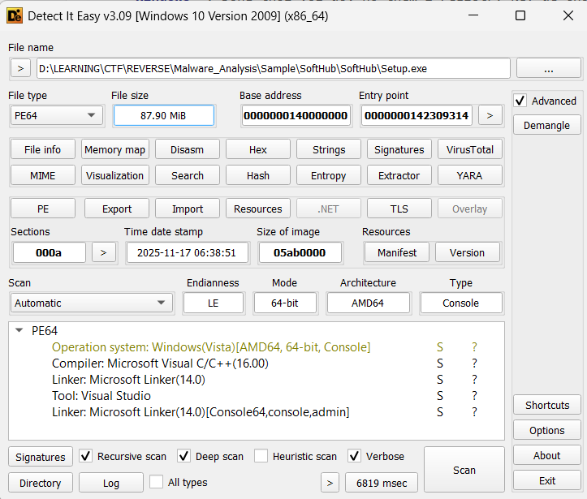

- File `falcon.exe`:

  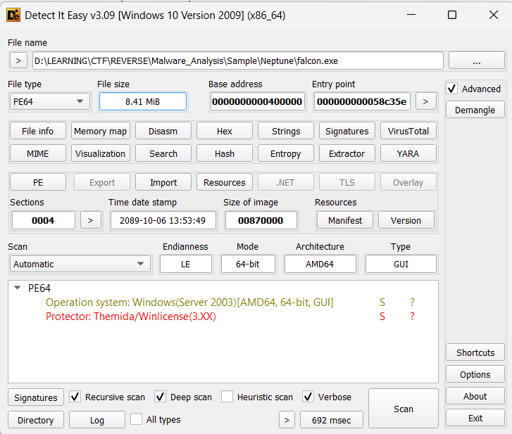

- File `summer.exe`:

  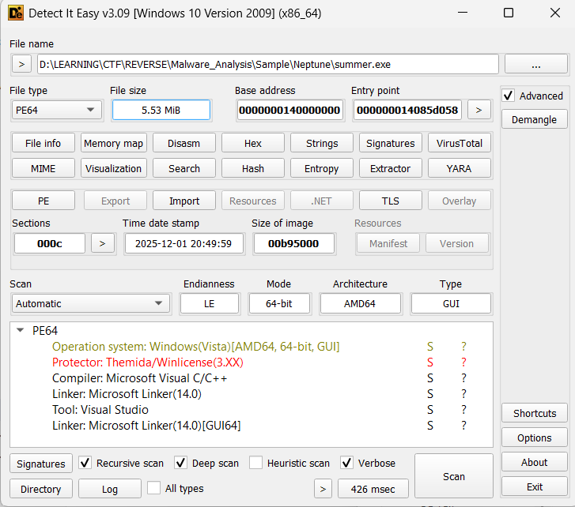

- Kết luận: Cả 3 file này đều là file thực thi trên Windows với định dạng file PE64, trong đó:
  - File `Setup.exe` là file thực thi khá rõ ràng
  - File `falcon.exe` và `summer.exe` là file thực thi đã bị pack bởi trình **packer Themida/Winlicense(3.XX)**
- Mã hash như đã đề cập ở mục **0. Tổng quan**

### 2.2. Các Strings:

- Xem trong bảng Strings của IDA thì thấy có 1 vài string rất đáng ngờ, cụ thể, trong bảng string này:
    - Có các đoạn mã **Nodejs** rất dài, có lẽ đây là toàn bộ 1 chương trình nodejs được nhúng vào trong file `Setup.exe`:

        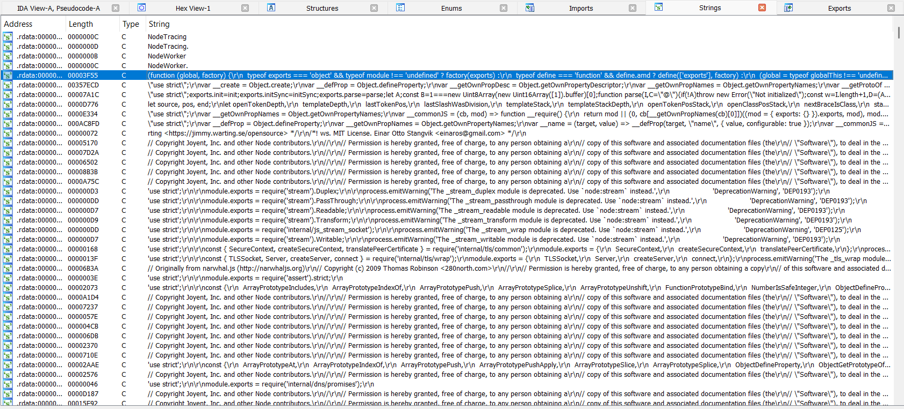
    
    - Có 1 vài đoạn chèn kí tự `\t` (Tab) khá dài, (có lẽ là để giấu đi đoạn mã độc chính) cùng với 2 thông báo **"Node.js QUIC Server"** và **"There are pending queries"** có thể đoán đây là 1 log thông báo kết nối tới C2 server

        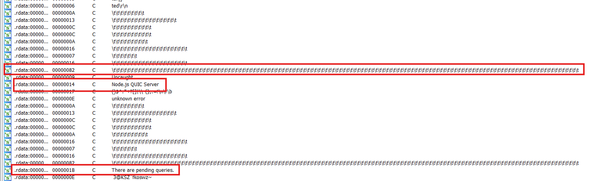
    
    - Ngoài ra còn có các string đáng ngờ khác như sau:

        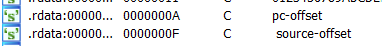

        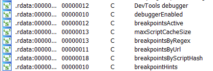

        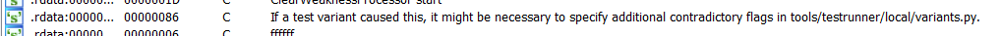

        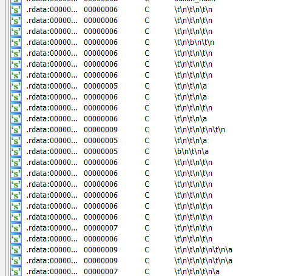

        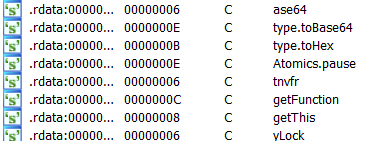

        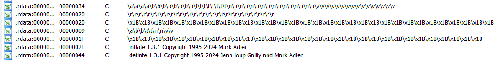

### 2.3. Các hàm/thư viện được import
- Thư viện **ADVAPI32**: cung cấp các hàm tương tác với các dịch vụ của hệ thống và Windows Registry:

    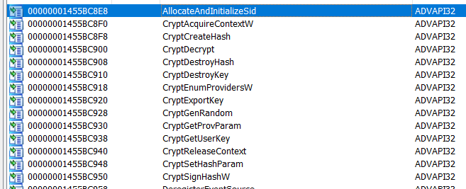

- Thư viện **IPHLPAPI**: cung cấp các hàm hỗ trợ việc kết nối Internet:

    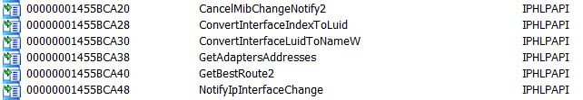

- Một số hàm trong **kernel32.dll** liên quan đến việc tạo tạo và ghi file:

    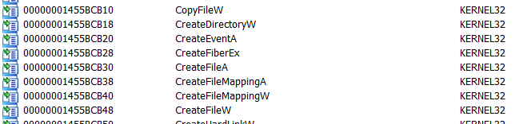

- Một số hàm trong **kernel32.dll** liên quan đến việc tạo tiến trình mới và thực thi một số đoạn mã:

    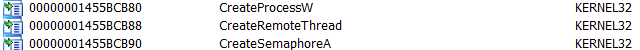

- Một số hàm trong **kernel32.dll** liên quan đến việc xoá file:

    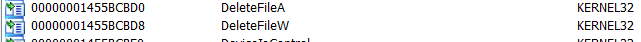

- Một số hàm trong **kernel32.dll** dùng để tìm kiếm các file có trong thư mục được chỉ định:

    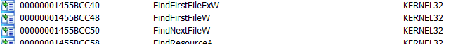

### 2.4. Các hành vi
- Nhận xét tổng quan: Đây là một mã độc trojan giả danh chương trình **`node.exe`**.
- Lý do mình khẳng định đây là trojan giả danh chương trình `node.exe` là bởi khi mình đọc các đoạn mã giả đã decompile của mã độc thì thấy nó tải chương trình nodejs phiên bản `25.2.1` nên mình đã lên trang web chính thức của nodejs và tải về và check 1 vài string thấy cả 2 giống hệt nhau

  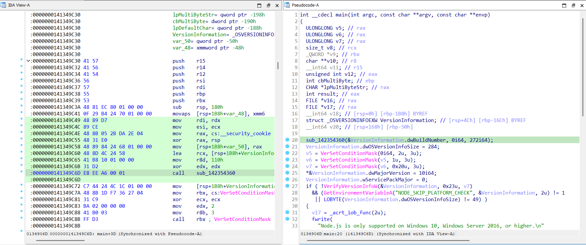

  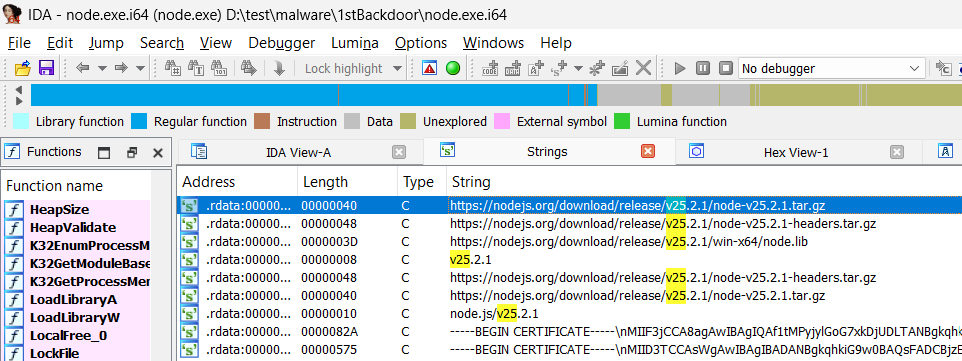

- Tuy nhiên, nếu cả 2 chương trình giống nhau hoàn toàn thì chương trình `Setup.exe` không thể coi là mã độc được. Ngoài ra, trong thực tế, khi chạy chương trình đó thì mình có phát hiện nó sinh ra 1 số file không chính thống và có kết nối tới server để tải thêm các file khác về nên mình sẽ thực hiện phân tích động để làm rõ hành vi của mã độc này.
- Đối chiếu với VirusTotal thì mình có một số đánh giá như sau: [link virustotal](https://www.virustotal.com/gui/file/b27f17dec9e4cfa81853201b1118a66881e4beb372fe65cc432fbed616ece077/behavior)
  - File này được nhận định là 1 mã độc dạng trojan, họ sbadur:

    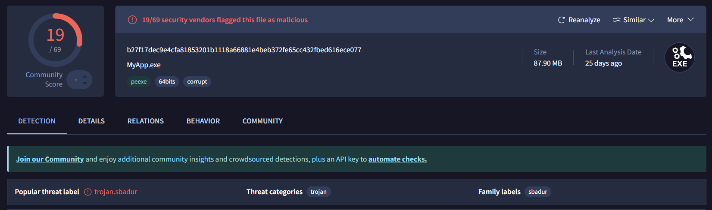

  - Có hành vi kết nối Internet:

    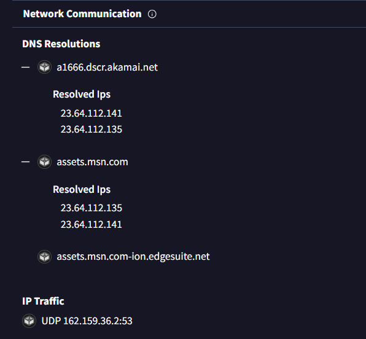

  - Có hành vi đọc ghi file `log.txt`:
    
    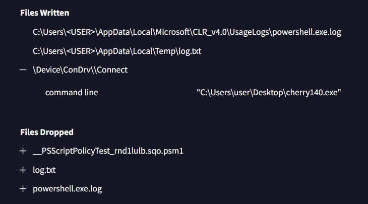

  - Có hành vi mở shell câm để thực hiện 1 số hành vi dưới nền:

    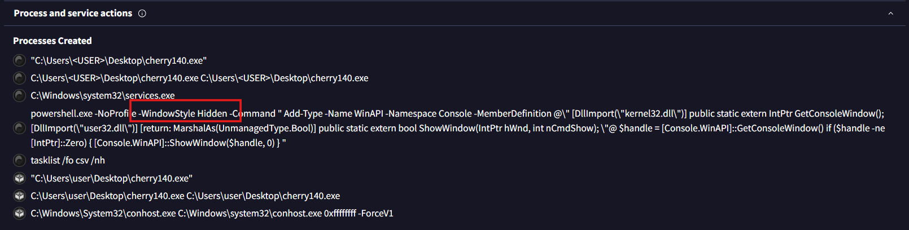

## 3. Phân tích động
### 3.1. Phân tích động cơ bản
- Trước hết mình sẽ thực hiện phân tích động cơ bản với việc chạy thử trong môi trường sandbox.
- Trước khi chạy chương trình, mình sẽ setup các môi trường và tool như sau:
  - Môi trường thực thi: Máy ảo VMWare Windows 10 có mở sẵn Google Chrome (Lý do là trong thực tế chương trình này đánh cắp mật khẩu mạng xã hội lưu trong trình duyệt này).
  - Tool sử dụng: Process Monitor và Regshot.
  - Ngoài ra, để tránh bỏ sót hoặc có vấn đề gì xảy ra cần phải khôi phục trạng thái, mình tạo 1 snapshot máy ảo 1 lần và đặt tên nó là "Normal".

    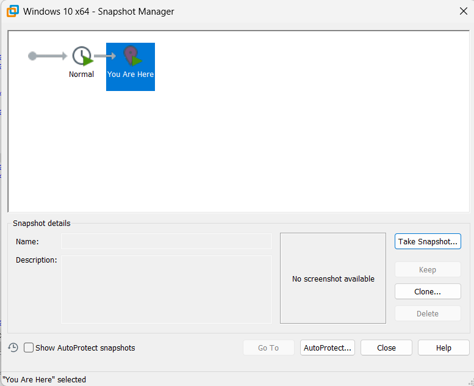

- Với Process Monitor, mình setup các sự kiện cần capture như hình dưới đây:

  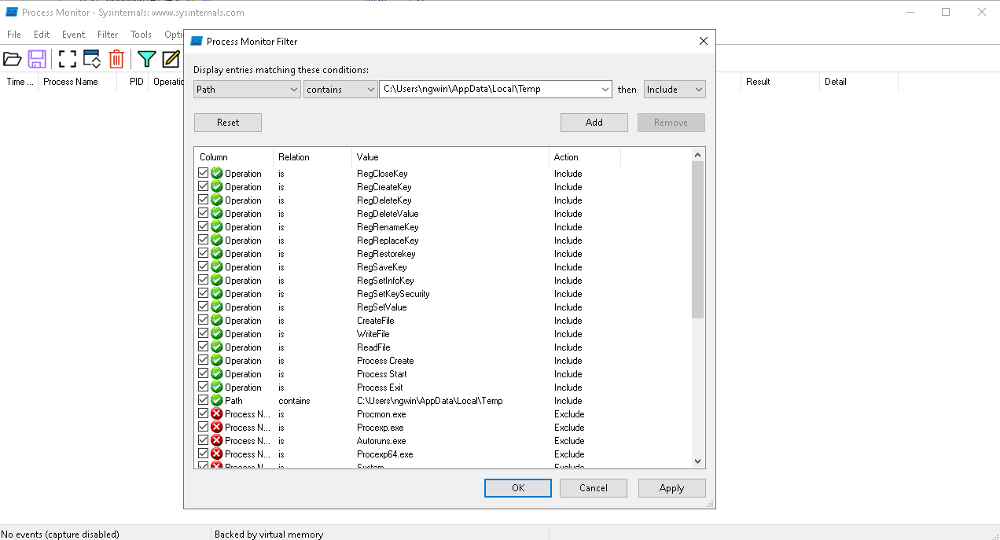

- Với Regshot, mình bấm shot 1 lần để lưu lại toàn bộ các thông tin registry khi máy đang hoạt động bình thường.

  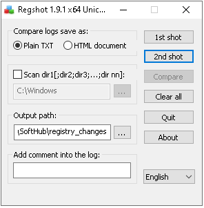

- Tiếp theo, mình tiến hành chạy chương trình rồi kiểm tra những sự thay đổi.

### 3.2. Kết quả Procmon
- Sau khi chạy chương trình Setup.exe, mình kiểm tra trong công cụ procmon thì thấy các sự kiện bắt được như hình dưới

  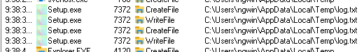

  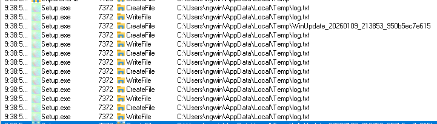

  - Cụ thể, tiến trình **`Setup.exe`** đã tạo 1 file `log.txt` trong thư mục `C:\Users\user\AppData\Local\Temp` và ghi các log để xác nhận các hành vi sau các bước thực hiện của chương trình.
  - Ngoài ra, tiến trình này còn tạo 1 folder **`WinUpdate_20260109_...`** để chuẩn bị tải các file độc hại cần thiết.
- Ngay bên dưới ta có thể biết file được tải về là file gì:

  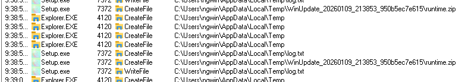

  - Ở đây có thể thấy chương trình **`Setup.exe`** đã tạo file **`runtime.zip`**, nói cách khác, nó đang tải file **`runtime.zip`** từ 1 server nào đó và ghi vào trong thư mục **`WinUpdate_20260109_...`**. Tuy nhiên, chỉ có quá trình CreateFile xảy ra đối với file `runtime.zip` mà không có quá trình WriteFile, ngoài ra, ngay sau tiến trình CreateFile `runtime.zip` bên dưới có quá trình WriteFile đối với file `log.txt`. Tại đây, mình không thể phân tích được thêm gì từ công cụ procmon.

### 3.3. Kết quả Regshot
- Sau khi regshot lần 2 mình đã so sánh và lưu ra file [compare_regshot.txt](IOCs/compare_regshot.txt), tuy nhiên trong số các thay đổi được ghi lại này không có dấu hiệu nào độc hại, chủ yếu là các thay đổi trong khi thao tác với hệ thống Windows vì thế trước mắt chưa thể kết luận chương trình `Setup.exe` là chương trình chính gây hành vi độc hại.

### 3.4. Kết quả file `log.txt`
- Như đã phân tích ở trên, Windows ghi lại hành vi tạo và ghi file của chương trình `Setup.exe` và lưu vào 1 file [`log.txt`](IOCs/log.txt) trong thư mục Temp.
- Có thể thấy log này được viết bằng tiếng Nga nên có thể dự đoán phần nào nguồn gốc của mã độc.
- Khi dịch log tiếng Nga này ra có thể phân tích dễ dàng hành vi của chương trình này hơn:

  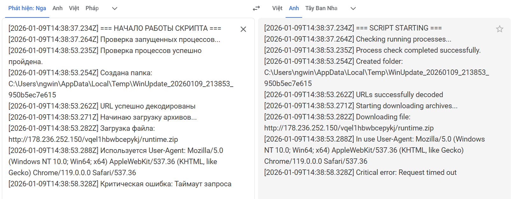

- Về nội dung, có thể tạm mô tả hành vi như sau:
  - Tạo 1 folder `C:\Users\user\AppData\Local\Temp\WinUpdate_20260109_213853_950b5ec7e615`.
  - Chuẩn bị tải 1 file `runtime.zip` từ server có sẵn, cụ thể là `http://178.236.252.150/vqel1hbwbcepykj/runtime.zip`, về thư mục vừa tạo trong Temp.
  - Trong khi tải file đó về, chương trình lấy thông tin User Agent của trình duyệt để gửi về server.
  - Tiếp theo chương trình chờ kết nối tới server thành công để tiến hành tải file `runtime.zip` về máy nạn nhân. Tuy nhiên, trong log ghi lại là **"Request timed out"**, có nghĩa là hết thời gian chờ kết nối. Điều này có thể tạm kết luận rằng thời điểm chạy chương trình `Setup.exe` thì server đã đóng để tránh phát hiện.
  - Trong trường hợp này, mã độc được chạy vào thời điểm khá muộn nên không thể tránh khỏi các nỗ lực ngăn chặn truy vết. Vì thế, nếu dừng lại ở đây thì không thể phát hiện thêm hành vi nào khác khiến cho hệ thống máy tính bị thay đổi so với ban đầu.
- Rất may mắn, ở thời điểm bị nhiễm mã độc, mình đã kịp thời lưu lại toàn bộ file log và phần nào đó các file liên quan để dễ dàng phân tích tiếp các hành vi ở thời điểm đó.

### 3.5. Kết quả file `log.txt` ở thời điểm bị nhiễm
- File log ở thời điểm bị nhiễm mình đã lưu tại [log.txt](IOCs/log_infected.txt).
- Có thể thấy ngay sau log lấy thông tin User-Agent thì có log thông báo đã tải thành công file `runtime.zip`

  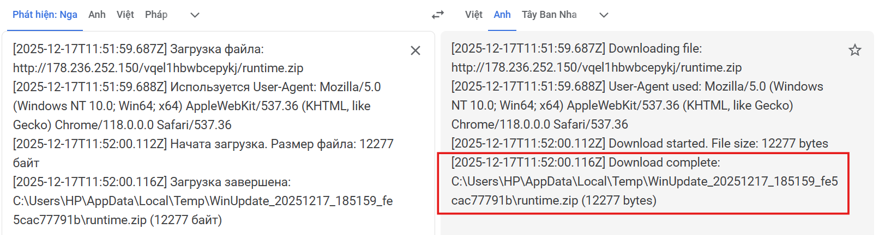

- Tương tự, sau đó mã độc liên tục thực hiện các hành vi:
  - Tải các file `cmake.zip`
  - Unzip file `runtime.zip` ra file `updater.exe` rồi chạy file `updater.exe` này.

    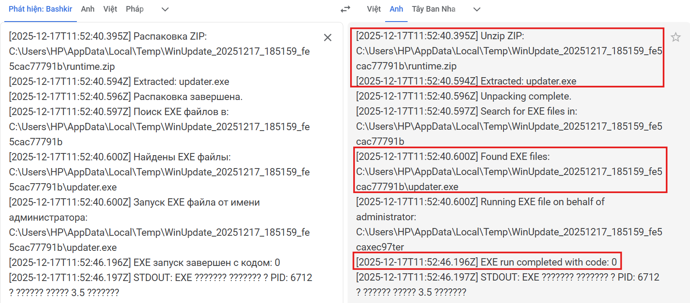
  
  - Tạo 1 thư mục ẩn `C:\ProgramData\Neptune`, sau đó giải nén file `cmake.zip` vào thư mục này, từ đây, trong thư mục xuất hiện 3 file mới có tên lần lượt là `root1.exe`, `root2.exe`, `root3.exe`, sau đó 3 file này theo thứ tự được đổi tên thành `falcon.exe`, `summer.exe`, `dispute.exe`.

    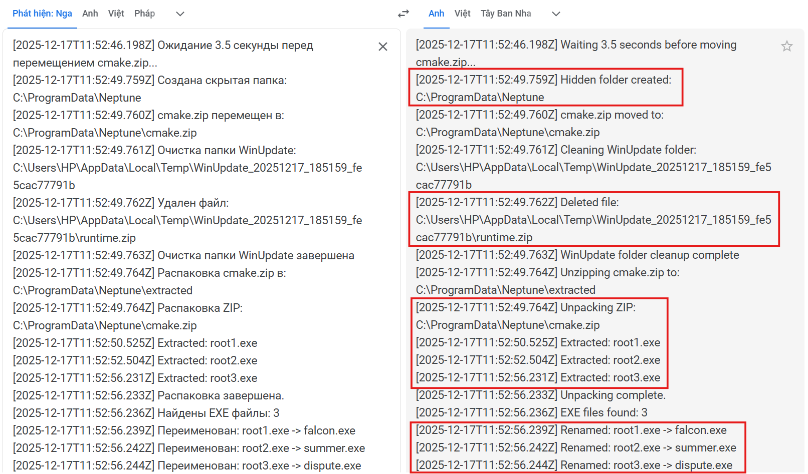

  - Ngoài ra, các file `runtime.zip`, `cmake.zip` còn bị xoá ngay sau khi đã giải nén xong, sau đó 3 file được giải nén từ `cmake.zip` lần lượt được thực thi.

    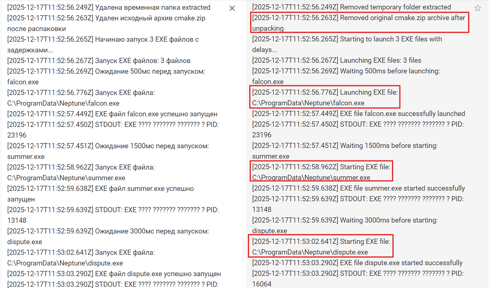

> **KẾT LUẬN:** Dựa vào các log được ghi lại, ta có thể biết được có thêm file `runtime.zip` được tải về và giải nén thành file `updater.exe`, file `cmake.zip` được tải về và giải nén thành 3 file `falcon.exe`, `summer.exe` và `dispute.exe`.
---
Với file `updater.exe` và file `dispute.exe` thì sau khi được giải nén, nó đã bị một tiến trình khác xoá (có thể là do đã xong nhiệm vụ) và chỉ để lại 2 file `falcon.exe` và `summer.exe` để làm cơ chế persistence. Tiếp theo mình sẽ phân tích các hành vi của 2 file `falcon.exe` và `summer.exe`.

### 3.4. Phân tích file `falcon.exe`
- Như đã đề cập ở đầu phần báo cáo này, mình đã sử dụng detect it easy và có được thông tin ban đầu file này là file thực thi trên Windows nhưng bị pack bởi trình packer Themida. Hiện tại chưa có tool nào unpack trực tiếp nên mình sẽ tiến hành chạy trực tiếp mã độc này trên hệ thống máy ảo và theo dõi những sự thay đổi có thể thấy bằng mắt thường, sau đó kiểm tra một số chi tiết kĩ thuật rồi cuối cùng đối chiếu với các công cụ quét virus hay sandbox trực tuyến.
- Trước tiên, vì chương trình này đã bị pack bởi Themida nên nó sẽ rất nhạy cảm với các công cụ giám sát tiến trình và trạng thái như procmon, procexp hay regshot, cùng với cả các debugger. Do đó mình không mở bất kì 1 công cụ nào khác mà chỉ dựa vào những gì thấy được sau khi chạy để tiếp tục phân tích.
- Với file `falcon.exe`, khi mình chạy xong bằng cmd và kiểm tra trong bảng tiến trình thì thấy tiến trình `falcon.exe` vẫn còn tồn tại trong khi tiến trình cha là cmd đã tắt, nên mình nghi ngờ chương trình này có dấu hiệu sử dụng kỹ thuật injection và sự tồn tại của tiến trình này trong bảng tiến trình là để chạy 1 vòng lặp `while True`, có thể là để duy trì kết nối tới server.

  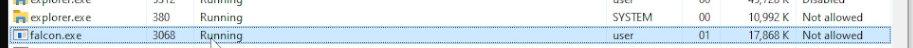

- Trong ảnh trên, 1 dấu hiệu lạ khác mà mình phát hiện được đó là tiến trình `explorer.exe` thường chỉ chạy với quyền user bình thường nhưng ở đây lại được chạy với quyền SYSTEM mà không có tác động trực tiếp trước đó.
- Vì có nghi ngờ về kỹ thuật Injection nên mình đã thử sử dụng công cụ `hollows_hunter` để quét thử thì phát hiện thêm 1 vài dấu hiệu khác nữa:
  - Đầu tiên là các tiến trình nghi ngờ bị quét:

    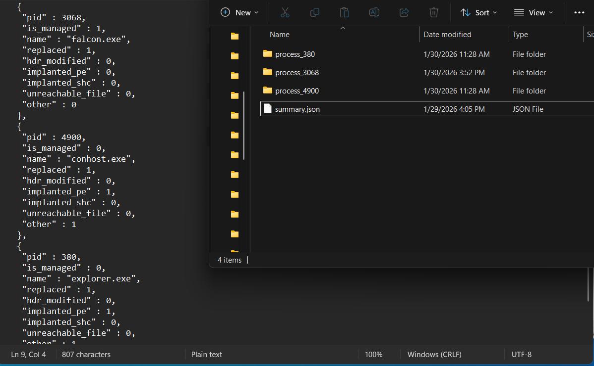
  
  - Đúng như dự đoán, tiến trình `falcon.exe` có dấu hiệu sử dụng kỹ thuật Process Injection, ngoài ra còn có tiến trình `conhost.exe` và `explorer.exe`, 2 tiến trình được dump này mình sẽ phân tích ở phần tiếp theo. Mình sẽ tập trung vào chương trình `falcon.exe` được dump ra trước.

    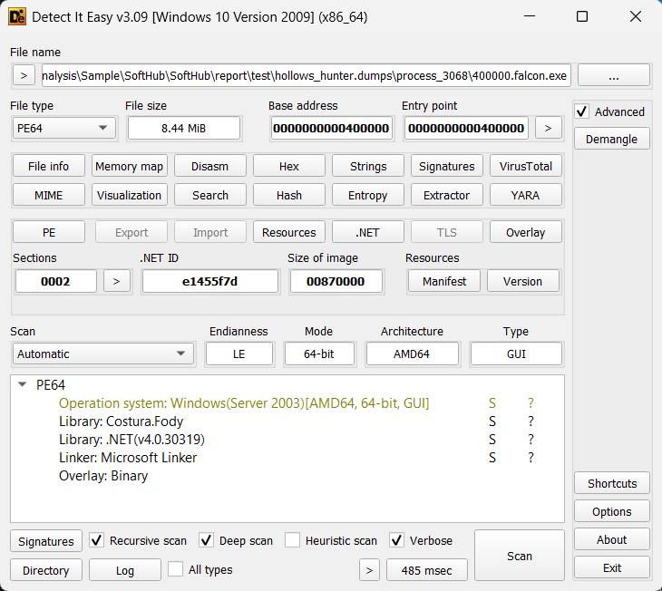
  
  - File này là 1 file PE không bị pack, mà khá rõ ràng, đây là 1 chương trình được code bằng C#. Tại đây mình sử dụng công cụ dnspy để xem qua một vài hành vi của nó. Từ Entry Point ở hàm Main, mình có thể thấy xung quanh đó có các dấu hiệu khá đáng ngờ.

    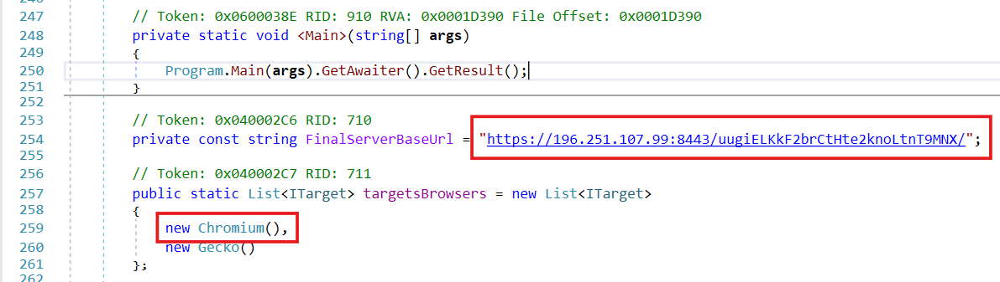

  - Thứ nhất, tring hardcode trong ảnh dẫn tới 1 nghi ngờ chương trình này có kết nối tới C2 server để trao đổi dữ liệu. Thực tế khi mình kiểm tra network của tiến trình này thì phát hiện nó thực sự có kết nối tới địa chỉ IP hardcode trên:

    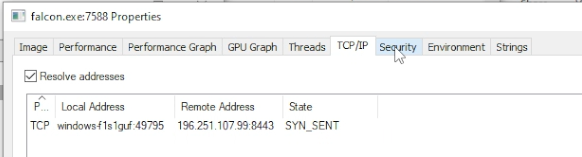

  - Và điều khiến mình bất ngờ nhất là khi ping thử thì IP này vẫn còn "sống" và có reply trả về:

    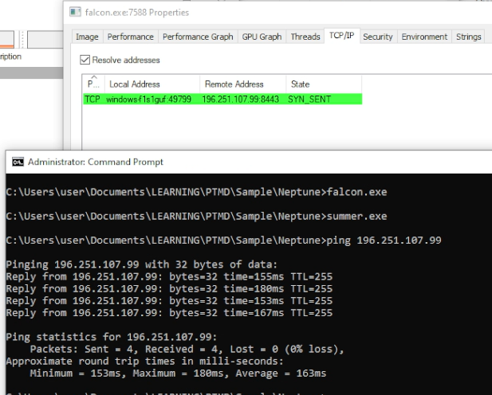

  - Thứ hai, ở đoạn khai báo `targetsBrowsers` có khởi tạo thêm 1 đối tượng tên là `Chromium()`. Khi mình focus vào class này thì mình phát hiện nó dùng để đánh cắp thông tin đăng nhập của người dùng được lưu trong trình duyệt:
  
    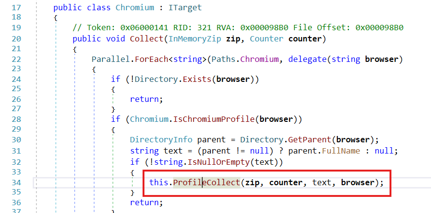

  - Khi focus vào hàm `ProfileCollect()` thì mình phát hiện có đầy đủ các logic đánh cắp thông tin như sau:

    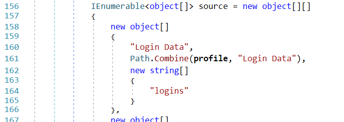

    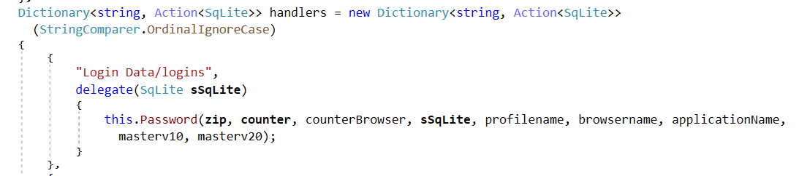

  - Như vậy có thể kết luận hàm này lấy nội dung file "Login Data" từ trong thư mục gốc của trình duyệt cùng với việc kiểm tra một số cấu hình và file liên quan và cuối cùng gửi về server với hàm sau:

    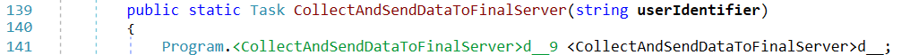

    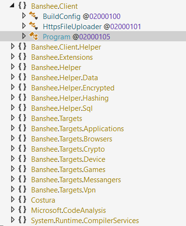

  - Ở đây có thể thấy còn khá nhiều module khác, tuy nhiên, nhìn tổng quan thì chương trình này lấy ra khá nhiều thông tin về hệ thống của victim.

### 3.5. Phân tích file `summer.exe`
- Như đã nói ở trên, file `summer.exe` cũng bị pack bởi themida nên nó cũng sẽ có cơ chế anti-vm và anti tất cả các tool detect cũng như debugger nên mình sẽ trực tiếp chạy thử chương trình này trên máy ảo anti-detect. Kết quả mình nhận được và phát hiện được như sau:
  
  - Trước khi chạy chương trình, registry key `BITS` (có liên quan tới sự ổn định của Windows Update) hoàn toàn bình thường, không gây vấn đề gì nghiêm trọng cho máy.

      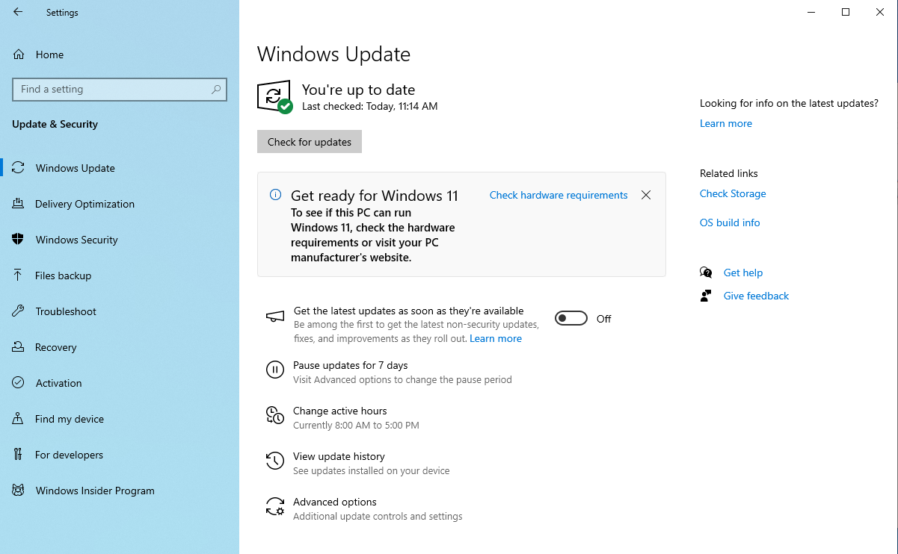

      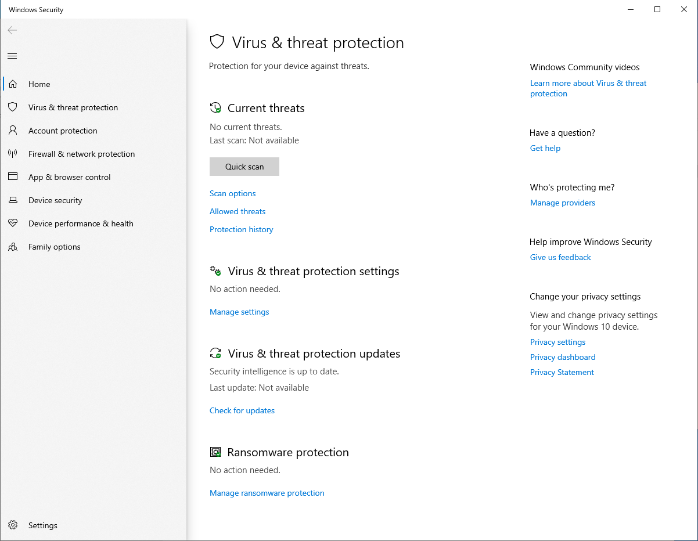

  - Tuy nhiên khi chạy chương trình với quyền administrator xong thì mình phát hiện Windows Update không thể truy cập được thì mình đã vào regedit để kiểm tra thử:

    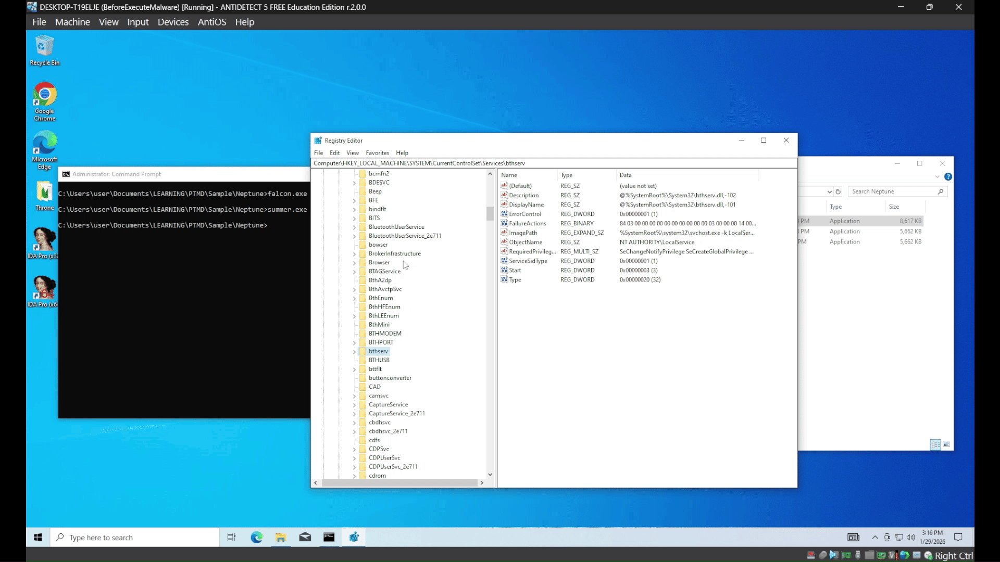

  - Đương nhiên, key `BITS` đã bị sửa thành `BITS_bkp` nên Windows Update hoạt động không đúng cách do nó chỉ đọc các key trong `BITS` thay vì `BITS_bkp`. Có lẽ cả tính năng `Virus & threat protection` cũng bị ảnh hưởng và bị vô hiệu hoá:

      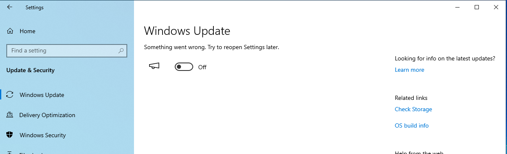
      
      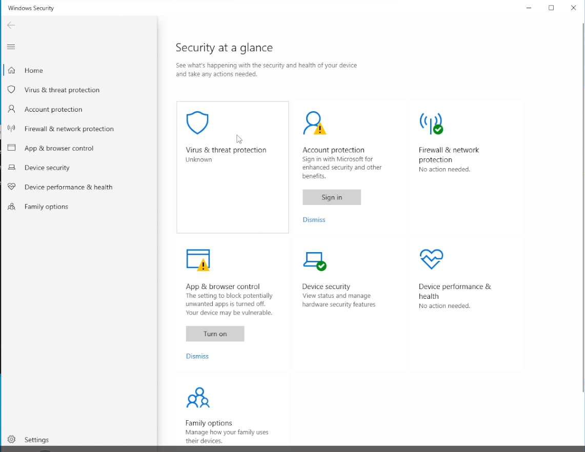

  - Như vậy có thể thấy chương trình `summer.exe` rõ ràng đang có các hành vi nỗ lực ngăn cản nạn nhân thực hiện việc update Windows, cập nhật bản vá và khả năng quét virus để tìm các mối nguy hiểm tiềm ẩn.
  - Ngoài ra, mình nhận thấy khi chạy chương trình `summer.exe` thì trong công cụ `Autoruns` phát hiện có 1 chương trình khác tên là `updater.exe` được tạo ra tại thư mục `C:\ProgramData\Google\Chrome`.

    

    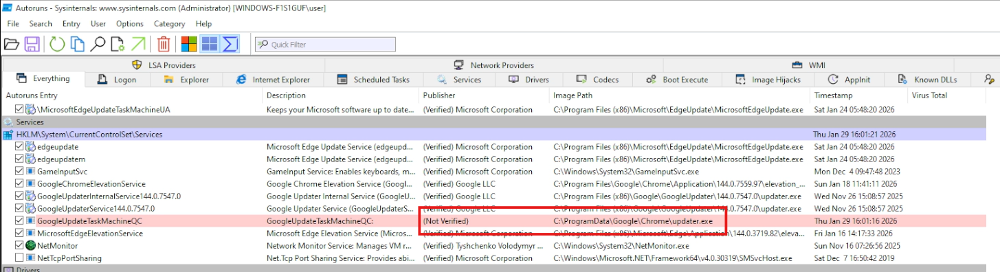

  - Vốn dĩ đây không phải là thư mục mặc định để chứa các app trình duyệt hay bất cứ app nào khác mà mặc định thường là `C:\Program Files\...`. Khi đó mình thử kiểm tra hash 256 xem nó có trùng khớp với mẫu nào liên quan trong quá trình mình phân tích này không thì hoá ra nó chỉ là 1 bản sao của chương trình `summer.exe`, có lẽ mã độc sử dụng cách này để duy trì sự tồn tại của nó trên hệ thống máy nạn nhân.
  - Để chắc chắn hơn về dự đoán đó của mình thì ngay tại công cụ Autoruns, mình đã chuột phải và click Jump to Entry thì thấy nó hiện ra trong Registry Editor:

    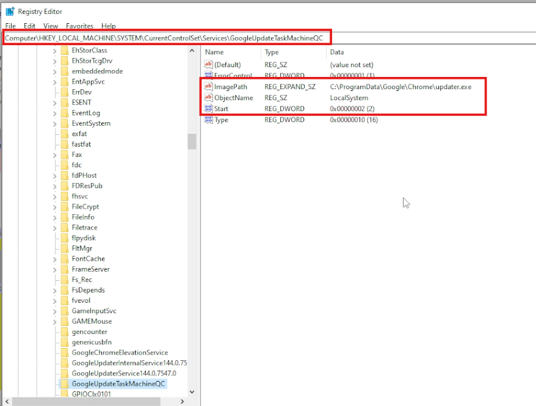

  - Để ý kĩ ở đây có thể thấy nó đặt key `ObjectName` là `LocalSystem` và key `Start` với giá trị `0x2`, nghĩa là nó sẽ tự khởi động khi hệ thống được reboot và chạy với quyền SYSTEM như đang chạy hiện tại.
  - Quay trở lại một chút ở phần đầu mình có đề cập khi đi từ file `log.txt` mình phát hiện `runtime.zip` giải nén ra file `updater.exe` nhưng nó lại được giải nén vào thư mục `WinUpdate_20260109_...` và sau đó thư mục này đã bị xoá nên mình không thể biết chính xác `updater.exe` đó đã làm gì thì có thể dự đoán `updater.exe` đó và `updater.exe` trong thư mục `C:\ProgramData\Google\Chrome` mà mình vừa tìm được là cùng một chương trình.

### 3.6. Phân tích vùng nhớ PE `10a0000.explorer.exe` dump được từ hollows hunter
- Đầu tiên mình sử dụng DIE để kiểm tra các thông tin cơ bản về chương trình này:

  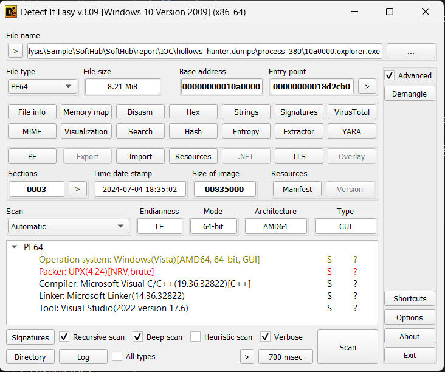

- Hash 256: `3bb5adefa0ecb97c7a63e680cbe053298c270b0baf235138900c23ab887e7333`

- Từ kết quả DIE có thể thấy rõ chương trình dump ra là 1 chương trình đã bị pack bởi UPX, tuy nhiên đây là một chương trình được dump từ trong tiến trình nên đã có ít nhiều những sự thay đổi trong quá trình thực thi nên rất khó để có thể phân tích được hành vi của nó. Tuy nhiên, khi sử dụng các công cụ giám sát tiến trình khác, mình có thể thấy được hành vi của nó là có kết nối tới 1 địa chỉ IP bên ngoài (130.12.182.32):

  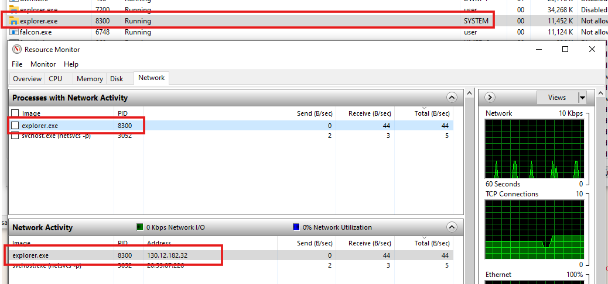

- Mình sử dụng IPinfo để kiểm tra thì thấy đây chỉ là 1 server có lẽ là chỉ nhận dữ liệu được tải lên. Sau đó mình sử dụng Wireshark để bắt các [gói tin](IOC-network/IPconnections.pcapng) liên quan đến địa chỉ IP này thì thấy nó có các dấu hiệu khá rõ ràng của 1 crypto-mining:

  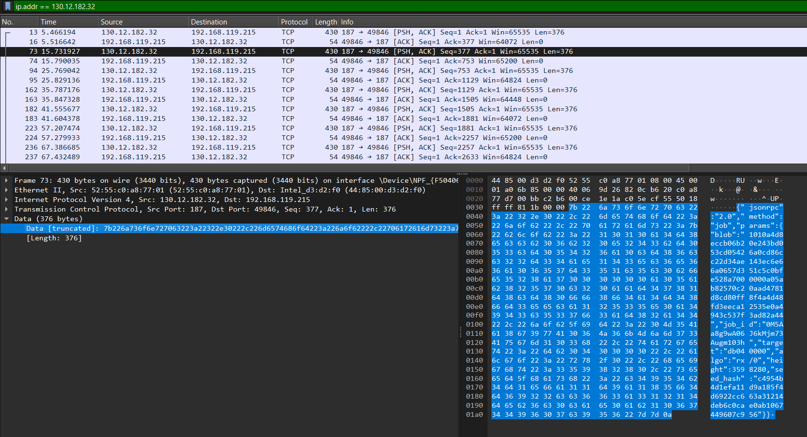

  ```
  {"jsonrpc":"2.0","method":"job","params":{"blob":"1010a4d8eccb06b20e243bd053cd05426a0cd86cc22d34ae143ec6e66a0657d351c5c0bfe528a7000000a05ab82570c20aad4781d8cd80ff8f4a4d48fd3eeca12535e0a4943c537f3ad82a44","job_id":"0M5Aa8g9wA06J6kMjm73Augm103h","target":"db040000","algo":"rx/0","height":3598280,"seed_hash":"c4954b4d1efa11d9a185f4d6922cc663a31214deb6c0cae0ab1067449607c956"}}
  ```

- Để kết luận chắc chắn hơn, mình đã tải file này lên trang `any.run` ([kết quả](https://app.any.run/tasks/9af32af7-1098-4fff-a14f-6489d4587250/)) thì được nhận xét đây là 1 phần mềm dạng [`XMRIG`](https://www.checkpoint.com/cyber-hub/threat-prevention/what-is-malware/xmrig-malware/) - 1 phần mềm mã nguồn mở sử dụng cho việc đào crypto coin.

  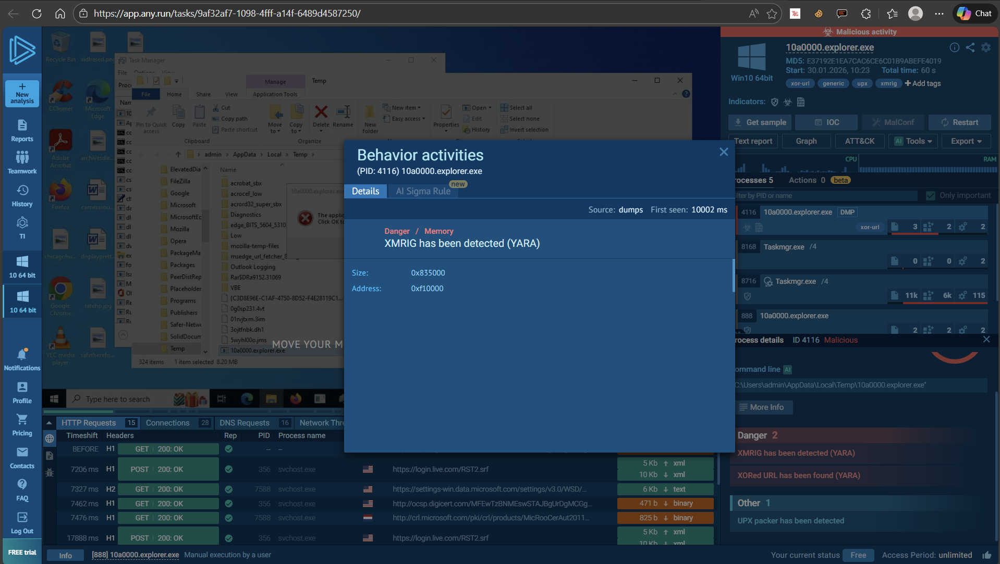

### 3.7. Phân tích vùng nhớ PE `164b77b0000.conhost.exe` dump được từ hollows hunter
- Trước hết mình kiểm tra các thông tin cơ bản:

  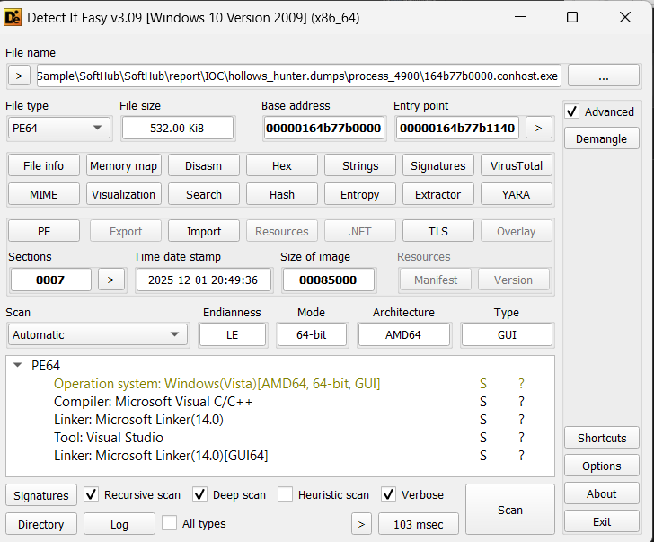

- Hash 256: `2bc459d0a565e74d7f9fa34b78afb899fb6a95233c1ec2c191749b96683d3fb8`

- Đây là 1 file PE64 được compile bằng C/C++ và không có trình packer nào được sử dụng. Tiếp đó mình đã tải lên VirusTotal để xem thử thì đánh giá sơ bộ vùng nhớ này là 1 mã độc dạng miner đào coin tương tự như `...explorer.exe` như trên.

  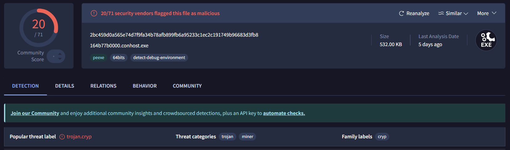

## 4. Kết luận
Tóm tắt quá trình tấn công:
  - Nạn nhân chạy file `Setup.exe` giả danh công cụ cài đặt Adobe Photoshop.
  - `Setup.exe` thực chất lại giả danh chương trình dựng web js là `node.exe` và hành vi thực sự của nó là tải 2 file độc hại `falcon.exe` và `summer.exe`. Giai đoạn này có ghi lại log để xác nhận tải và giải nén thành công trong file `log.txt`.
  - 2 file được tải về bị pack bởi Themida nên không thể trực tiếp debug trên máy ảo VMWare hay sử dụng debugger như IDA Pro.
    - Với `falcon.exe` bị pack, nó tự khởi động:
      - 1 tiến trình khác cùng tên và sử dụng kĩ thuật Process Injection (hoặc inject vào chính nó) để duy trì sự tồn tại trong tiến trình, mục đích là đánh cắp thông tin tài khoản và hệ thống máy tính của nạn nhân và gửi về cho máy chủ.
      - 1 tiến trình `explorer.exe` và 1 tiến trình `conhost.exe` chạy với quyền SYSTEM sử dụng kĩ thuật Process Hollowing để đánh lừa cảnh giác, mục đích của nó là biến máy nạn nhân thành công cụ để đào coin
    - Với `summer.exe`, thực hiện 1 loạt các hành vi sửa registry key để:
      - Ngăn chặn Windows Update có thể vá lỗ hổng gây bất lợi cho attacker.
      - Vô hiệu hoá trình phát hiện virus của Windows.
      - Tự thiết lập cơ chế persistence, biến nó trở thành bootkit.

Tóm lại, theo nhận định cá nhân của mình thì attacker đã chuẩn bị khá kĩ cho cuộc tấn công này, đối với người dùng bình thường rất khó để có thể nhận ra sự hiện diện của mã độc bởi nó sử dụng khá nhiều kĩ thuật để lẩn trốn cùng với cơ chế persistence.

Vì đây là lần đầu tiên mình gặp mã độc trojan trong thực tế nên vẫn còn những thiếu sót trong quá trình phân tích. Trong cuộc tấn công này, mình đã kịp thời nhận thấy các dấu hiệu để ứng phó sự cố một cách nhanh nhất, giảm đáng kể thiệt hại cho máy nạn nhân, đồng thời đã kịp lưu lại các IOC để phục vụ quá trình phân tích sau này.

> P/s: Tuy cuộc tấn công khá là công phu nhưng mình vẫn cảm thấy mã độc loại này không quá nguy hiểm vì nó chỉ là trojan - nếu biết cách gỡ thì không có vấn đề. Trong trường hợp nó là ransomware thì mọi nỗ lực ứng phó sự cố gần như bằng 0. Ngược lại, nếu không phát hiện kịp thời thì toàn bộ tài khoản cá nhân cũng như tài nguyên máy tính cũng sẽ trở thành của attacker.